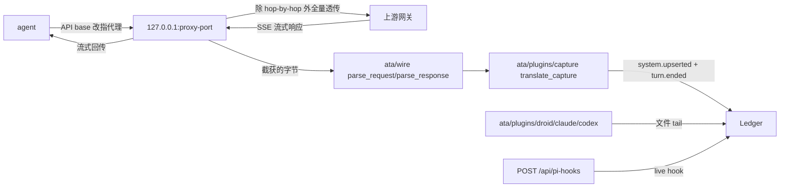

# 代理采集通道 / Proxy Capture Channel

`--proxy-port` 把 agent 的 LLM 流量原样转发给上游，把请求与响应截获下来翻译成账本里别处拿不到的事实。代理只是补充通道，不是权威平面。

| 词 | 定义 |
| --- | --- |
| 代理 | `ata/capture_proxy.py`；一个 `ThreadingHTTPServer`，监听 `--proxy-port`，把请求转发给上游并截获响应字节 |
| wire 解析内核 | `ata/wire/`；纯函数 `parse_request` / `parse_response`，从字节里抽出 `system_prompts` / `tool_items` / `usage` 等事实 |
| capture 适配器 | `ata/plugins/capture.py`；按身份规则把 record 翻成规范事件 |
| 通道边界 | 代理只发 `system.upserted` 与 `turn.ended`，不发 message / tool 行；详见下表 |

## 通道拓扑

代理与文件 tail 两条通道写同一 session，靠幂等键收敛；代理刻意不发 message / tool 行。

## 转发头策略

| 头 | 处理 |
| --- | --- |
| `host` / `content-length` / `connection` / `transfer-encoding` | hop-by-hop 黑名单，不转发 |
| 其它头（含 `authorization` / `x-api-key`） | 原样转发给上游网关（上游需要客户端 key） |
| 落档侧白名单 | record 的 `request_headers` 只收 `x-claude-*`；认证头不进账本 |

红线是「认证头不落账本」，不是「不转发」。

## 代理只发的事实

| 事实 | 来自 | 为何只有代理能拿 |
| --- | --- | --- |
| `system.upserted` | `req.system_prompts` + `req.tool_items` | Claude / Droid 第一方落盘不写 system prompt 与完整 tools 目录 |
| `turn.ended.usage` | `resp.usage`（input / output / cache_read / cache_write） | 同上；Codex 虽能拿但代理对任意未鉴权宿主有效 |
| `message.upserted` | — | 代理不发（transcript 已有，发了会 natural-key 写序竞态） |
| `tool.upserted` | — | 代理不发（同上） |
| `session.opened` | — | 代理不发（sid 是宿主真 id；发 opened 会与 transcript 适配器抢同键） |

## 身份规则

| 规则 | 实现 |
| --- | --- |
| 恢复宿主 sessionId | 各家宿主携带会话 id 的请求头（如 Claude 的 `x-claude-code-session-id`），见 `ata/plugins/capture.py` `_SESSION_HEADERS` |
| 恢复成功 | 事件 `session_id` 用宿主真 id，追加到同一 session |
| 恢复失败 | 丢弃，绝不新建孤儿会话（`ingest_capture` 抛 `ValueError`，壳吞掉不弄挂被代理请求，HTTP 端点回 400） |
| 写序 | 走 `Ledger.append_many`，与文件 tail 共享单 writer |

## 轮次口径

| 通道 | 轮次号来源 | 说明 |
| --- | --- | --- |
| 文件 tail 适配器 | `bump_turn_if_real_user` 实时递增 | 流式 |
| 代理通道 | `count_real_user_turns` 对请求上下文里的真实用户消息计数 | 静态 |

两条通道同口径的前提是「每次请求带全量历史」；宿主做 context 编辑 / microcompact（不落盘）裁掉早期用户消息时，代理算出的轮次会小于真实轮次，该轮 usage 挂错位置。幂等键收敛不了口径漂移；缓解路径是「轮次推导以 transcript 侧已开的最大轮为下限」，需要跨通道读账本状态，等真实数据里观察到漂移再上。

## SYSTEM 发射的去重

`system.upserted` 无自然键。代理侧每次请求都带全文，所以 `translate_capture` 算 `sha1(prompt_text + catalog)[:12]` 的 `system_hash`，与 `state["system_hash"]` 比对，内容变化时才发射。账本侧因此不会灌爆。

## 已知限制

| 限制 | 行为 |
| --- | --- |
| 轮次口径漂移 | 宿主裁掉早期用户消息时，代理算的轮次偏小；usage 挂错位置（见上） |
| 新会话可见性空窗 | 代理不发 `session.opened`；代理事件已入账但 sessions 列表暂时没有行，要等 transcript tail 扫到文件才浮出——这是裁决内行为，不是 bug |
| 上游 OpenAI 族 | wire 解析只对 anthropic 协议生效；OpenAI 族解析（codex 走非 anthropic 时可用）暂缓，registry seam 已预留 |
| 协议版本变更 | 上游改动 `system_prompts` / `usage` 字段名时，`ata/wire/anthropic_parser.py` 需更新；record 形状不变 |

## 启用与排错

| 任务 | 命令 |
| --- | --- |
| 启动 | `python3 -m ata serve --proxy-port 8319` |
| 改上游 | `--proxy-upstream`（默认 `api.anthropic.com`） |
| 改 agent_id | `--proxy-agent`（默认 `claude`） |
| dev 脚本 | `./scripts/serve-dev.sh`，设 `ATA_PROXY_PORT=8319` 即开代理通道 |
| 代理未拿到 SYSTEM | 检查请求头是否带宿主 `x-claude-code-session-id`（或对应宿主头）；缺则被丢弃 |
| sessions 列表没新行 | 预期空窗；等 transcript tail 扫到宿主文件 |
| 账本里 user 消息只剩 1 条且是 `<system-reminder>` | `fix(capture): emit user 消息时过滤 CONTEXT 注入` (adbbc31) + `fix(capture): user mid 派生走 message_items index` (b2f79cd) | 旧 sid 不修,新事件按新逻辑 |

## 引用边界

| 边界 | 不外推成 |
| --- | --- |
| 代理对任意宿主都能补 SYSTEM | 只对能解析的协议族（anthropic）有效；OpenAI 族暂缓 |
| 轮次口径同 transcript | 宿主裁掉早期用户消息时不等 |
| SYSTEM 全文一定捕获 | 上游协议变更时 wire 解析需同步更新 |

## 代码出处

| 概念 | 文件 · 符号 |
| --- | --- |
| 转发壳 | `ata/capture_proxy.py` `start_capture_proxy` |
| hop-by-hop 黑名单 | `ata/capture_proxy.py` `_HOP_HEADERS` |
| 落档白名单 | `ata/capture_proxy.py` 截获处 `x-claude-*` |
| wire 解析 | `ata/wire/parser.py` `parse_request` / `parse_response` |
| anthropic 协议细节 | `ata/wire/anthropic_parser.py` |
| 协议事实 | `ata/wire/protocol_facts.py` |
| 身份规则 | `ata/plugins/capture.py` `resolve_session_id` / `_SESSION_HEADERS` |
| 翻译 | `ata/plugins/capture.py` `translate_capture` / `_translate` |
| SYSTEM 去重 | `ata/plugins/capture.py` `_system_hash` + `state["system_hash"]` |
| 轮次计数 | `ata/plugins/capture.py` `count_real_user_turns` |
| 入账收口 | `ata/plugins/capture.py` `ingest_capture` |
| HTTP 端点 | `ata/http.py` `h_capture`（`POST /api/captures`） |
| CLI 参数 | `ata/__main__.py` `--proxy-port` / `--proxy-upstream` / `--proxy-agent` |
| 决策 | [`../adr/0001-proxy-capture-channel.md`](../adr/0001-proxy-capture-channel.md) |
