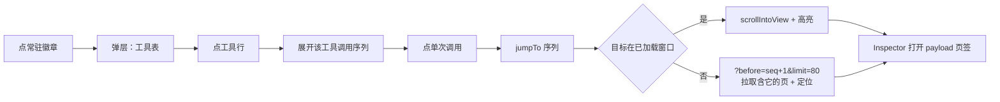

# 工具统计与钻取 / Tool Stats and Drilldown

单会话工具调用的统计 + 钻取视图，回答四个递进问题：调了多少次 → 哪个失败多 → 哪一次失败 → 为什么失败。

| 词 | 定义 |
| --- | --- |
| 常驻徽章 | Timeline 顶栏的 `Σ N calls`，失败非零追加 `⚠ K` |
| 工具泳道 | 主表 TOOL 行的方块条带；绿 = completed，红 = failed，黄 = pending |
| 钻取 | 弹层里点工具行展开每次调用：状态点 / 时间 / 耗时 / 入参预览 |
| 跳转 | 点钻取条目滚到对应 TOOL 行并打开 Inspector 的 payload 页签 |

## 端到端布局



## 服务端与前端职责

| 层 | 职责 | 落点 |
| --- | --- | --- |
| 服务端 | 按会话聚合工具调用 + 计 `total` / `failed`，按时间保序返回调用序列 | `ata/project.py` `summarize_tools(recs)` |
| HTTP | 暴露 `GET /api/sessions/{sid}/tool-stats` | `ata/http.py` `h_session` 子路径 `tool-stats` |
| 前端派生 | 从已加载 `rows` 自算 `ToolStat[]`，按 `失败数 → 调用数` 降序 | `webapp/src/components/session/stats.ts` `toolStats` |
| 弹层渲染 | 徽章 + 弹层 + 钻取 + show more | `webapp/src/components/session/StatsPanel.tsx` `StatsBadges` |
| 时间拆解徽章 | LLM vs 工具逐轮 | `webapp/src/components/session/TimeBadge.tsx` |
| usage 趋势 | 逐轮 input / output 双色条 | `webapp/src/components/session/usage.tsx` + `UsagePanel.tsx` |
| 过滤 chips | 主表按 kind / status 一键过滤 | `webapp/src/components/session/SessionView.tsx` |

前端派生走的 `rows` 由 `useSession` 返回的整段投影，不是分页窗口——所以「分页窗口会漏」的旧担心不成立。

## 数据契约

`GET /api/sessions/{sid}/tool-stats`：

```json
{
  "ok": true,
  "tools": [
    {
      "name": "Bash",
      "total": 22,
      "failed": 0,
      "calls": [
        {"seq": 1042, "ts": 1700000000000, "status": "completed",
         "duration_ms": 311, "text": "ls -la (120 字符内截断)"}
      ]
    }
  ],
  "summary": {
    "tools": 12, "calls": 87, "failed": 3,
    "mounted": 18, "usage_rate": 66
  }
}
```

| 字段 | 来源 | 说明 |
| --- | --- | --- |
| `name` | `tool.upserted.payload.name` | 工具名 |
| `total` | 该工具的 `tool.upserted` 终态行数 | 沿用 `list_tools` 的 latest-wins |
| `failed` | `status == "failed"` 的行数 | 与前端 `toolStats` 同口径 |
| `calls` | 同工具的全部 `tool.upserted` 终态行（按时间） | UI 钻取用 |
| `text` | 适配器生成的入参单行描述 | `_tool_text(args)`，120 字符内截断 |
| `summary.tools` | 全部去重工具数 | |
| `summary.calls` | 全部调用总数 | |
| `summary.failed` | 全部失败数 | |
| `summary.mounted` | `tools_catalog` 去重名字数 | 来自 `system.upserted`；没有目录时为 `null` |
| `summary.usage_rate` | `min(100, round(工具数 / 挂载数 * 100))` | 挂载为空时为 `null` |

> 不在端点里返回 `result` 全文与 `args` 全文：`/tools` 端点已能取全文，本端点只为计数与导航。

## 排序与去重

| 规则 | 原因 |
| --- | --- |
| 服务端按工具首次出现顺序保序 | 与前端派生结果一致 |
| 前端派生按 `失败数 → 调用数` 降序 | 失败多的优先浮上来 |
| 不用调用次数降序 | 实时会话下布局抖动 |
| 同 `tool_call_id` 多次 upsert 字典 last-wins | `summarize_tools` 复用 `list_tools` 的去重，不重写 |

## 钻取与跳转

| 级 | 形态 |
| --- | --- |
| 折叠态 | 一行摘要：`N calls · K failed`；K 非零标红 |
| 一级 | 每工具一行的状态方块条带（前端泳道） |
| 弹层 | 工具表 + 每行失败数 / 调用数 |
| 钻取 | 点工具行展开该工具的调用序列；初始 8 条，show more 追加；状态点 / 时间 / 耗时 / 入参预览（120 字符内截断） |
| 跳转 | 点调用条目触发 `jumpTo(row.id)`；目标在已加载窗口内 `scrollIntoView` + 高亮；不在则 `?before=seq+1&limit=80` 拉取含它的页再定位；同时打开 Inspector 到 payload 页签 |

## 已知边界

| 边界 | 行为 |
| --- | --- |
| 进行中会话 | 跳转后行内容以最新投影为准；账本继续更新，本地阅读器场景下接受 |
| 适配器缺 failed 终态 | 失败方块永远不出现；按 bug 报（详见 [`../guides/manual-test-guide.md`](../guides/manual-test-guide.md)） |
| 没装代理通道 | Claude / Droid 拿不到 usage；TimeBadge 标 missing |
| Droid 每轮 usage 恒 Missing | 契约上限，不是 bug |
| 缓存命中 | 本地中转语料 cache_read / cache_write 系统性为 `null`；不单独成图，并入 usage 趋势做列 |

## 明确不做的路

| 候选 | 原因 |
| --- | --- |
| MCP 工具按名字前缀分类统计 | 账本无 MCP 来源标记；前缀匹配是启发式 |
| 跨会话聚合（工具失败率趋势） | 单会话统计用出体感再立；数据形状已兼容 |
| 「存入回归任务集」一键入口 | 真实需求出现再立（见 [`regression-and-rating.md`](regression-and-rating.md)） |
| 耗时 Top-N | 统计区布局定型后再设计 |
| 父子会话 lineage 展示 | 端点已有，UI 位置需单独设计 |
| URL hash 锚点直达某行 | 改 URL 语义，需单独讨论 |

## 引用边界

| 边界 | 不外推成 |
| --- | --- |
| 弹层按 `失败数 → 调用数` 降序 | 任意宿主都该这样；Droid 拿不到 failed 时全空（数据边界） |
| 钻取不带 result 全文 | 任何情况下都不带；`/tools?full=true` 取全文 |
| `usage_rate` = 工具数 / 挂载数 | 任何时候都不硬算；挂载为 `null` 时 `usage_rate` 同样为 `null` |

## 代码出处

| 概念 | 文件 · 符号 |
| --- | --- |
| 服务端聚合 | `ata/project.py` `summarize_tools` |
| 端点 | `ata/http.py` `h_session` 子路径 `tool-stats` |
| 前端派生 | `webapp/src/components/session/stats.ts` `toolStats` |
| 弹层 + 钻取 | `webapp/src/components/session/StatsPanel.tsx` `StatsBadges` |
| 徽章挂载点 | `webapp/src/components/session/SessionView.tsx` `<StatsBadges>` |
| 时间拆解徽章 | `webapp/src/components/session/TimeBadge.tsx` |
| usage 趋势 | `webapp/src/components/session/usage.tsx` + `UsagePanel.tsx` |
| 过滤 chips | `webapp/src/components/session/SessionView.tsx` |
| 跳转 | `webapp/src/api/useSession.ts` `jumpTo` + 窗口外拉取 |
