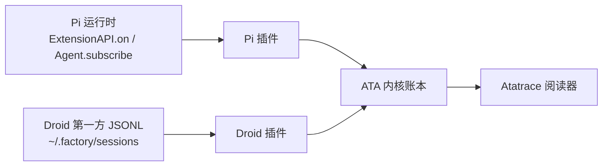

# ATA v1 · 规范事件内核

- **状态**：产品边界与架构已锁定；Claude Code / Codex 接入面已核过源码锚点，公约数已回填。字段名已由实施计划冻结
- **日期**：2026-08-15（字段名冻结回填 2026-08-16）
- **项目**：`repos/ata`（空仓库，不导入旧 AVA 实现）
- **实现门**：在 `repos/ata/` 写生产代码前必须先跑 `/ponytail full`

本文只记录已经拍板的合同，以及四家对照后必须守住的公约数。字段名的权威清单在《2026-08-15-ata-v1-end-to-end-reader》实施计划第 1 节，本文只钉概念与边界；先冻结谁写、谁读、缺了怎么标。Claude Code / Codex 的账本适配器已于 2026-08-16 纳入 v1 首段并实现（见第 6.3 / 6.4 节）；反向代理仍不是实现范围。

## 1. 一句话

ATA 是本地 Agent 轨迹阅读器。产品 UI 名是 **Atatrace**。内核只收带版本号的规范事件；每个 agent 自己的插件负责把方言翻成这种事件。第一期做空 Atatrace、Pi 参考插件，以及 Droid / Claude Code / Codex 的第一方账本适配器。反向代理放最后。

## 2. 已锁定决策

| 决策 | 选择 | 不选 |
| --- | --- | --- |
| 仓库 | 新开 ATA，只移植合同不搬 AVA 单体 | 在 AVA 上继续加层 |
| 权威平面 | 规范事件。来源可以是 live 流，也可以是第一方账本适配器；HTTP 抓包可选，没有就 `Missing` | 以代理流量当账本 |
| 插件产出 | ATA 规范事件 + 显式 `agent_id` | 内核认识各家方言 |
| 推进顺序 | 一次打通一个 agent，代理最后 | 先做万能代理再补插件 |
| 第一期生产者 | Pi + Droid + Claude Code + Codex | 其余 13 个名字当远期范围 |
| Droid 第一期 | 适配器 tail 本机第一方 `~/.factory/sessions/**/*.jsonl` | Droid 整只标 incomplete；扫描第三方 transcript |
| 用量 | 要的是每一轮模型调用的 usage，不要工具自己的 usage | 会话合计充数；用合计除以轮数 |
| 阅读器 | 只画 Atatrace，只吃规范事件 | 第一期做 Evidence / 全量 `loadDetail()` |
| 旧库 | 不导入 AVA | 复用 viewer 或 Python 代理 |

优先级仍是：秒开 > 轨迹 > 覆盖 > 计量 > 分发。秒开要砍的是「换一条记录就拉整包详情」，不是把 Python 换成 Rust。

## 3. 产品边界

规范事件：一条带版本号、带 `agent_id`、能单独追加的会话账本记录。内核只认这一种。

### 3.1 v1 看见什么

| 层 | 看见 |
| --- | --- |
| 内核 | 校验后的规范事件；按 `session_id` 追加；给阅读器分页 |
| Atatrace | 会话列表与按轮次组织的账本；第一屏只拉索引和一页事件 |
| Pi 插件 | `v0.83.0` / `845d6ff1` 的官方 extension：`ExtensionAPI.on()` 或嵌入式 `Agent.subscribe()` |
| Droid 插件 | 本机第一方 JSONL 的增量 tail，以及为会话合计准备的同目录 `*.settings.json`（合计不是每轮 usage） |
| Claude Code 插件 | 本机第一方 transcript（`~/.claude/projects/**/*.jsonl`）的适配器，锚点 `2.1.88` / `a8a678c`；消息/tool_result 走官方 API 消息形态，无 system 行、无 turn 事件（缺了标缺口） |
| Codex 插件 | 本机第一方 rollout（`~/.codex/sessions/**/rollout-*.jsonl`）的适配器，锚点 `2b5bdcf675`；`session_meta` 带 `base_instructions`（可发 SYSTEM）与 `originator`（标题），`token_count.last_token_usage` 对齐每轮 usage |

### 3.2 v1 不看见什么

- 反向代理、Docker、桌面壳、sub2api 级按请求计费
- 其余 13 个 agent 名字（只是远期目录）
- 旧 AVA 的 record / Evidence / 一次拉全量详情。AVA 只作辅证；v1 不把 Evidence 或全量详情卡嵌进主时间线
- 插件没声明的 vendor 字段
- 第三方 transcript 的隐式扫描
- Droid 尚未核实的 live hook 词表（本机只核实到已安装的 `SessionStart`）

### 3.3 必须写进边界的降级

| 情况 | 做法 |
| --- | --- |
| 厂商有事件、对不上规范类型 | 插件标 `Missing`，不补猜 |
| Pi 的 Compaction / Spawn | `subscribe()` / `on()` 文档序列没有同名事件；能从官方 session/fork/compact 钩子一对一映射就映射，不能就 `Missing`，不从工具名猜 |
| Droid 大 session | 卡点应停在插件自己的 JSONL 增量翻译，禁止把整份文件塞进阅读器 |
| Droid 每轮 usage | 当前 JSONL 样本的 `message` / `agent_turn_outcome` 没有 token 字段；第一期标 `Missing` |
| 短命、不落盘的派生 | 账本里没有就不画；按 transcript 加总 token 会漏这一类 |

## 4. 架构

三层只认规范事件，不认厂商文件。

| 层 | 做什么 | 不准做什么 |
| --- | --- | --- |
| 插件 | 读自己的方言，写出规范事件 | 让内核打开厂商路径；把缺的面补成假完整 |
| 内核 | 校验、追加、分页 | 打开 `~/.factory/sessions`、Pi session 文件、HTTP 抓包、旧 AVA record |
| 阅读器 | 画 Atatrace | 回源厂商文件；一次拉整段会话正文 |

同一份规范事件账本同一时间只有一个 writer：插件经内核 API 追加，阅读器只读。插件挂了，内核仍能打开已经收下的事件。

数据只朝一个方向走：

`厂商运行时或第一方账本 → 该 agent 的插件 → 内核账本 → Atatrace`

### 4.1 Atatrace 视觉合同

产品称谓是 Atatrace，不借用 dsh 的产品名 Trajectory。v1 只借 `repos-external/deepseek-harness/packages/client/ui-trajectory` 的视觉模式，不搬它的包、slot、Session 快照或 Trajectory 专名。

主参考（必须守住）：

| 模式 | 在 Atatrace 里怎么做 | dsh 锚点，只说明出处 |
| --- | --- | --- |
| 轮次账本 | 主视图是垂直事件表，按厂商自己划的 Turn 分段 | README：turn-aware event ledger |
| 粗分割线 | Turn 边界用比行内步骤更粗的分割线 | README：thick rules mark Turn boundaries |
| 主表三列 | 已加载窗口里，主表只留索引、事件、内容；用量、耗时、载荷和结果进局部检查器 | README：index / event / content；selection opens a local inspector |
| 尾部打开 | 长账本打开时停在当前尾部；流式更新默认跟着尾部；用户上滚后暂停跟随 | README：open at the current tail；scrolling upward suspends following |
| 虚拟行 | 行数过阈值后只挂可见窗口加少量 overscan；分隔行并入下一可测行 | `TrajectoryTable.tsx`：阈值 100、overscan 12；`trajectory-virtual-rows.ts` |
| Overview 三泳道 | 账本上方固定一条从左到右的时间轴，三条泳道是 Input / Model / Tools；色块按当前投影落到泳道上，未知前缀只画中性省略号，不虚构时长 | README：fixed Overview；`TrajectoryTimeline.tsx` 的 `LaneLabels` |
| 四投影 | 工具栏 Duration × Actual time 组出 `sequence` / `duration` / `time` / `actual`。默认 `sequence`。切投影会清掉当前时间窗 | `timeline.ts` 的 `deriveTrajectoryTimeline()`；`TrajectoryView` 的 mode 组合 |
| 缩放与平移 | 滚轮按光标位置缩放；放大后右键拖平移；拖选碰到左右 8% 边带时视口跟着走。缩回全窗后右键不再平移 | `TrajectoryTimeline.tsx`：`exp(deltaY * 0.0015)`；最小域 `sequence=4` / 其余 `20` |
| 拖选时间窗 | 在时间轴上横拖，框住一段闭区间；账本只强调这段里活跃过的记录，窗外色块压到 20%、行压到 24%。右键单击、双击或 Escape 清掉区间，恢复已加载全窗 | README：Dragging an interval focuses the ledger；`trajectoryTimelineFocusIndexes()` |
| 点色块选记录 | 单击一条色块选中对应账本行并打开检查器；点空白只聚焦最近记录并落下最小区间。悬停 500ms 弹出 kind、起止钟面和 Total | README：500 ms hover；`onRecordSelect` / `onRecordFocus` |
| 折叠与搜索 | Turns 折整轮、Calls 折 Assistant 后的工具；双击行与工具栏按钮同一套状态。搜索按词全中，命中才留在表里；时间轴上不匹配色块压到 14%，折叠此时不再生效 | `TrajectoryToolbar.tsx`；`trajectory-search-index.ts` |
| 更早页与虚拟行 | 时间轴左侧 `…` 与表头 `Load earlier history` 真加载更早页；滚到顶 48px 内也会要下一页。行数过 100 或仍有更早页时只挂可见窗口，overscan 12 | `TrajectoryTable.tsx`：阈值 100、overscan 12；`trajectory-virtual-rows.ts` |
| Request 与 SYSTEM | 事件列小圆点打开 Request 检查器（Summary / Usage / Timing），不改行选中。SYSTEM 行打开 Prompt / Tools，有上一版时多 Diff | `selectRequest()`；`trajectory-request-header-definition.ts` |
| 多分栏检查器 | 选中后右侧打开检查器。工具行至少有 Summary / Payload / Result / Schema / Timing；标题是角色标签加 `Turn N · Step M`。Summary 先写 Hierarchy、Status，再预览各栏。页签按最近使用记忆；左侧拖宽 320–720，双击复原；Started 可切 Unix 秒 | `TrajectoryTable.tsx` 的 `detailTabs()` 与 `detailsHeader` |

辅证与明确不做：

- AVA Evidence 与全量详情卡是另一证据面。v1 不把它们嵌进主时间线，也不做一次 `loadDetail()` 拉整包。
- 不把 dsh 的产品名、composer 浮层、`'conversation.view'` slot 环或 Session 快照写进 Atatrace。
- 选择、折叠、搜索、时间窗聚焦和请求汇总只覆盖当前已加载窗口，不假装已经看见未加载的前缀。
- 可点稿 `sketches/002-beautiful-workbench/index.html` 是 Atatrace 账本交互的视觉合同。上线版本按这份稿复刻泳道、四投影、缩放平移、拖选、折叠、更早页、虚拟行、Request/SYSTEM 和检查器页签，以及浅色/深色表面，不另做简化条。

## 5. 用量

用量是规范 Turn 上的可选字段，不是阅读器自己算出来的数。三种状态沿用 AVA 已经钉死的分法：`reported` / `estimated` / `missing`。没有证据就 `Missing`，不能当 0。

| 来源 | 每轮模型 usage | 说明 |
| --- | --- | --- |
| Pi 官方 extension | 可报 `reported` | `turn_end`（或 assistant 的 `message_end`）带着 `AssistantMessage`；`usage` 是必有字段，含 `input` / `output` / `cacheRead` / `cacheWrite` / `totalTokens` / `cost`，可选 `reasoning`（已计入 `output`） |
| Pi `AgentToolResult.usage` | 不写进 ATA | 工具自己报的，不进主 LLM 账 |
| Pi `after_provider_response` | 不是 token 来源 | 只有 HTTP `status` 与 `headers`，在开始消费流之前触发 |
| Droid JSONL | 第一期 `Missing` | 抽样记录没有每轮 token；`compaction_state.summaryTokens` 不是每轮模型 usage |
| Droid `*.settings.json` | 会话合计，不是每轮 | 本机见过 `tokenUsage` / `inclusiveTokenUsage` / `lastCallTokenUsage`；可作会话级 `reported`，禁止摊到每一轮 |

Pi 出错或中止时 usage 可能全是 0。Pi 自己的 compaction 代码已经把这种当不可信。ATA 同样标 `Missing`，不当 0。源码里有字段，不等于本机安装的那个 Pi 每次都会填上。

## 6. 第一期生产者

### 6.1 Pi（参考实现）

锚点：`repos-external/pi-agent` 的 `845d6ff1`，tag `v0.83.0`。结论只在这一个提交内成立。

插件形态：官方 TypeScript extension，放到 `~/.pi/agent/extensions/` 或项目 `.pi/extensions/`，不改 Pi 内核。

第一期挂这些事件：`before_agent_start`、`agent_start`、`turn_start`、`message_*`、`tool_execution_*`、`turn_end`、`agent_end`。每轮 usage 从 `turn_end.message.usage` 读取。`before_agent_start` 把 `systemPrompt` 与 `systemPromptOptions.toolSnippets` 转成 `system.upserted`（SYSTEM 快照发射，见第 7 节概念表；2026-08-15 真机验收发现 System Prompt 与 Tools 目录在 Atatrace 里不可见，计划默认条款已翻转为发射）。

### 6.2 Droid（第一方账本适配器）

本机没有核实到和 Pi 同级的 live 订阅 API。官方插件格式允许 `hooks.json`，marketplace 示例未提供。本机 hook 只装了 `SessionStart`，Herdr 脚本只上报 `session_id`。

已核实的 JSONL `type`：`session_start`、`message`、`todo_state`、`agent_turn_outcome`、`compaction_state`。

**形状注记（2026-08-16 审计 `~/.factory/sessions`）**：v2 形状与早期 marketplace 样本不同——session id 在 `session_start.id`（`message` 行的 `id` 是消息 id），`session_start` 带 `title`（可作会话标题），消息嵌套在 `message` 字段（`{role, content, visibility}`），`timestamp` 是 ISO 字符串，content 块含 `text` / `tool_use` / `tool_result` / `thinking` / `image`。适配器兼容 v1 顶层形状与 v2 嵌套形状。

| 规范面 | 本机样本能对上的东西 |
| --- | --- |
| Turn | `message` 的 `role=user/assistant`，加上 `agent_turn_outcome`（`resultKind` / `reason` / `turnId`） |
| Tool | `message.content[]` 的 `tool_use` / `tool_result`（注意这是厂商块类型名，不是 ATA 事件名） |
| Spawn | 部分 `session_start` 带 `callingSessionId` + `callingToolUseId`，或 `parent` + `forkedAtMessageId` |
| Compaction | `compaction_state`（见过 `summaryKind=llm_summary` / `provider_switch_serialization`） |
| 每轮 usage | 未在 JSONL 中核实到 |
| 标题 | `session_start.title` |

适配器按文件偏移增量 tail（目录递归 / 单文件统一），默认只处理最近 `--tail-max-age-days` 天内修改的文件（本机该目录有 3870 个历史会话，全量灌入会让账本超过 1 GB）；显式配置本机第一方路径。这不是 AVA 那种对第三方 transcript 的隐式扫描。

### 6.3 Claude Code（第一方账本适配器）

锚点：`2.1.88` / 还原提交 `a8a678c`（纯净树，`src/types/logs.ts`）。会话文件 `~/.claude/projects/<encoded-path>/<uuid>.jsonl`，每行一个 `Entry`：`user` / `assistant` 消息带 `message` 字段（官方 API 消息形态：`content[]` 里的 `text` / `tool_use` / `tool_result` / `thinking` 块，assistant 带驼峰 `usage`）；`ai-title` 行可提供标题；其余行（`summary`、`custom-title`、`last-prompt`、`queue-operation` 等）跳过。

| 规范面 | 本机样本能对上的东西 |
| --- | --- |
| Turn | Claude 无显式 turn 事件：用户消息到达即递增（同 Droid 规则），纯 `tool_result` 用户消息不算新轮；补发 `turn.started` |
| Tool | `message.content[]` 的 `tool_use` / `tool_result`，配对键 `tool_use_id`，拆 `:start`/`:end` |
| SYSTEM 快照 | **没有**——transcript 不落盘系统提示，因此不发射 `system.upserted`（诚实缺失） |
| 每轮 usage | assistant `message.usage`（`input_tokens` / `output_tokens` / `cache_read_input_tokens` / `cache_creation_input_tokens`），全 0 或缺失标 `missing` |

### 6.4 Codex（第一方账本适配器）

锚点：`repos-external/codex` @ `2b5bdcf675`（`codex-rs/protocol/src/protocol.rs`）。会话文件 `~/.codex/sessions/YYYY/MM/DD/rollout-<uuid>.jsonl`，每行 `{timestamp, type, payload}`。

| 规范面 | 本机样本能对上的东西 |
| --- | --- |
| Turn | `event_msg` 的 `task_started` / `task_complete`（`turn_id` 首次出现分配轮次号） |
| Tool | `response_item` 的 `function_call` / `function_call_output` 与 `custom_tool_call` / `custom_tool_call_output`，配对键 `call_id`，拆 `:start`/`:end` |
| SYSTEM 快照 | `session_meta.base_instructions` → `system.upserted`（`prompt_text`） |
| 每轮 usage | `event_msg.token_count.info.last_token_usage`（`input_tokens` / `cached_input_tokens` / `cache_write_input_tokens` / `output_tokens` / `total_tokens`），对齐最近一轮；全 0 或缺失标 `missing` |
| 标题 | `session_meta.originator`（首条用户 prompt） |

消息以 `response_item.message` 为单一来源，`event_msg` 的 `user_message` / `agent_message` 跳过（避免双写）；`compacted` / `context_compacted` 首段不发射。适配器支持显式传入路径（文件 tail / 目录一次性灌入），默认不碰 `~/.codex`。

## 7. 规范事件：先冻结概念，不冻结字段名

下面这些概念必须在 Pi / Droid / Claude Code / Codex 之间站得住。具体 JSON 键名由实施计划第 1 节冻结，本文只钉概念。

| 概念 | 含义 | 缺了怎么办 |
| --- | --- | --- |
| `agent_id` | 这条事件属于哪个 agent 实现 | 插件必须写；内核拒收 |
| `session_id` | 一条可打开的会话 | 插件必须写；内核拒收 |
| SYSTEM 快照 | 会话起始的系统提示与当时可见的工具目录，由 `system.upserted` 携带 `prompt_text` / `previous_prompt` / `tools_catalog`；`previous_prompt` 供 Diff 页签对照上一版 | 没有快照时，Atatrace 的 System Prompt / Tools 页签无内容可显示；不要把「没记录」当成「没有」 |
| Turn | 厂商自己划的一轮：一次 assistant 回复，加上这轮点出来的工具。不是一次 HTTP 请求 | 对不上就 `Missing`，不把多轮消息捏成一轮，也不把一轮里的多次 completion 拆成多轮 |
| Tool | 一次工具调用的开始/结束 | 只有结果没有开始也要标缺口 |
| Spawn | 落了盘、带父子 id 的派生会话 | 短命不落盘的派生不画 |
| Compaction | 厂商自己写出的压缩边界 | 上下文变短不是 compaction |
| 每轮 usage | 挂在 Turn 上的模型 token/cache/cost，不是工具自己的 usage，也不是单次 HTTP completion | 没有就 `Missing`；禁止用会话合计除以轮数 |
| 版本号 | 规范事件自己的 schema 版本 | 内核按版本校验 |

内核禁止从工具名、时间邻近或文件大小反推上述任何一项。

### 7.1 公约数（四家对照后必须守住）

后两家没有推翻第 2–6 节。它们证明：规范事件不能绑死任何一种厂商扩展 API。

| 公约数 | 为什么必须这样 | 若写成别的，后面会大改 |
| --- | --- | --- |
| 插件译、内核盲 | 四家方言不同：Pi 是 `ExtensionAPI.on` / `Agent.subscribe`；Claude / Codex 是 `hooks.json`；Droid 本机核实到的是第一方 JSONL | 内核一旦认识 `HOOK_EVENTS` 或 `~/.factory/sessions`，每加一家就要改内核 |
| 两种生产者，一种事件 | live 流和第一方账本适配器都必须写出同一种规范事件 | 只为 Pi 的 subscribe 建模，Claude / Codex / Droid 都进不去 |
| hook 是闸门，不是账本 | Claude 27 个、Codex 11 个 hook 都能插工具/压缩/子 agent；Stop / PreCompact 输入有 `session_id`、路径、有的还有 `turn_id`，**没有**每轮 token | 把 hook 当 Turn+usage 的唯一来源，四家的用量都会空或假 |
| usage 挂在 Turn，不挂在 hook，不挂在 Tool | Pi 在 `turn_end.message.usage`；Claude 在 assistant `message.usage`（会写进 transcript）；Codex 落盘的是 `TokenCount.last_token_usage`，单次 completion 的 `RawResponseCompleted` 不进 rollout；Droid JSONL 每轮是 `Missing` | 要求「每次 HTTP 都有 usage」会逼出代理；要求 hook 带 token 则 Claude / Codex 对不上 |
| Compaction 只认显式边界 | Claude 是 `compact_boundary` / `microcompact_boundary`（有一条微压缩不落盘）；Codex 是 `RolloutItem::Compacted`（`ContextCompacted` 只在 Legacy history 落盘）；Droid 是 `compaction_state` | 从 token 变少反推，会把切模型、截断、清工具结果都当成压缩 |
| Spawn 只认落了盘的父子 id | Claude 的 `runForkedAgent` 默认写 sidechain transcript，`skipTranscript` 才跳过；Codex 的 `SessionMeta.parent_thread_id` 落盘，但 `CollabAgentSpawnBegin/End` 默认不进 JSONL；Droid 部分 `session_start` 带 `callingSessionId` | 按工具名猜 Agent/Task，会把 Todo 和后台摘要画成子会话 |
| 第一方账本 ≠ 隐式扫描 | 三家都有自家 JSONL（Droid sessions、Claude transcript、Codex `~/.codex/sessions/.../rollout-*.jsonl`） | 内核自己扫默认目录，会回到 AVA 的隐式 transcript 扫描 |
| 大文件由插件增量翻 | Codex / Claude / Droid 的会话文件都会到几十 MB | 阅读器一次吃整份厂商文件，秒开目标直接破 |

四家对照（v1 只实现 Pi + Droid；后两列是防翻案，不是本期工期）：

| 面 | Pi `v0.83.0` | Droid 本机样本 | Claude Code `2.1.88` | Codex `2b5bdcf675` |
| --- | --- | --- | --- | --- |
| live | `on()` / `subscribe()` 即账本 | 未核实到同级订阅；本机只装了 `SessionStart` | 27 个 hook；执行器 `command`/`prompt`/`http`/`agent` | 11 个 hook；执行器 `Command`/`Prompt`/`Agent`；另有 app-server 通知 |
| 第一方账本 | 会话文件另计，v1 走 live | `~/.factory/sessions/**/*.jsonl` | transcript JSONL | `~/.codex/sessions/YYYY/MM/DD/rollout-*.jsonl` |
| Turn | `turn_start` / `turn_end` | `message` + `agent_turn_outcome` | hook 无完整 Turn 订阅；账本靠消息链 | `TurnStarted` / `TurnComplete` 总落盘 |
| Tool | `tool_execution_*` | `tool_use` / `tool_result` | `PreToolUse` / `PostToolUse`；transcript 里有工具块 | hook + `FunctionCall` 等总落盘 |
| Spawn | `newSession`/`fork` API；`subscribe()` 序列无同名事件 | `callingSessionId` 或 `parent` | 落盘 teammate 有 `--parent-session-id`；`runForkedAgent` 默认写 sidechain，`skipTranscript` 才跳过 | `parent_thread_id` 落盘；collab spawn 事件默认不落盘 |
| Compaction | `session_compact` 钩子 + compaction 条目 | `compaction_state` | `compact_boundary`；部分微压缩不落盘 | `Compacted` 总落盘 |
| 每轮 usage | `AssistantMessage.usage` | JSONL 未核实到 | assistant `message.usage` 随 transcript；压缩后会把旧消息 token 置 0 | 落盘 `last_token_usage`；精确单次 completion 不落盘 |

### 7.2 第一期 schema 明确不收的东西

这些不是「以后再加字段」那么简单。写进去会把内核绑到某一家。

- 任何一家的 hook 事件名、matcher、exit code
- 一次 HTTP / 一次 `RawResponseCompleted` 作为 Turn 的主键
- 会话合计、`inclusiveTokenUsage`、`factoryCredits` 摊到每一轮
- 工具结果上的 `AgentToolResult.usage`
- 内核直读的默认路径（`~/.factory`、`~/.claude`、`~/.codex`、`~/.pi`）
- OTel、rollout-trace、代理抓包作为账本权威

## 8. 非目标（整份 v1）

- 不实现反向代理、Docker 一键包装、Tauri/桌面壳
- 不做 sub2api 那种按请求计费、TTFT、联网定价表
- 不把旧 AVA 的 Python 代理或 viewer 搬进本仓库
- 不在知识库根目录加 Node 工作区；本仓内部不建嵌套 git
- 密钥、真实 Base URL、会话正文、用户采集内容不进代码、fixture、日志或本文

## 9. Claude Code 与 Codex（锚点参考）

这一节在 2026-08-16 之前是防翻案核验；两家账本适配器纳入 v1 后，这里仍是锚点与引用边界。源码里有路径，不等于用户安装的版本会发出。

### 9.1 Claude Code `2.1.88` / `a8a678c`

物证：本仓导读，加上从 `repos-external/claude-code-sourcemap` 解出的 `a8a678c` 纯净树（`git archive a8a678c restored-src`）。不读承载仓库工作树。

| 面 | 锚点 | 对 ATA 的含义 |
| --- | --- | --- |
| hook 词表 | `src/entrypoints/sdk/coreTypes.ts:25-53`，27 个名字 | live 插件能挂钩，但是闸门 |
| 执行器 | `src/schemas/hooks.ts`：`command` / `prompt` / `http` / `agent` | 第三方可写只外发、不改会话的 `command`/`http` |
| hook 基座 | `src/utils/hooks.ts` 的 `createBaseHookInput`：`session_id`、`transcript_path`、`cwd`，可选 `agent_id` / `agent_type` | 能关联会话和第一方 transcript；基座没有 token |
| Stop / Compact | Stop 带 `last_assistant_message`；PreCompact 带 `trigger` + `custom_instructions`；PostCompact 带 `compact_summary` | 生命周期能看见，每轮 usage 不能从 hook 拿 |
| transcript | `src/types/logs.ts`：`sessionId`、`parentUuid`、`agentId`、`isSidechain` | 第一方账本适配器与 Droid 同类 |
| 每轮 usage | `src/utils/messages.ts` 里 assistant `message.usage` 默认有 `input_tokens` / `output_tokens` / `cache_*`；API 路径会写回；压缩后 `sessionStorage` 会把保留消息的 token 置 0 | 账本可映射，但压缩后旧轮次会丢；全 0 必须当 `Missing` |
| Spawn | `runForkedAgent` 默认 `recordSidechainTranscript`；`skipTranscript` 留给 ephemeral（如 speculation）；teammate 传 `--agent-id` / `--parent-session-id` | 只有跳过 transcript 的派生按缺口处理 |
| Compaction | `compact_boundary` / `microcompact_boundary`；一条微压缩路径不改本地消息、不落盘 | 只认写出的边界 |

未能定位：类似 Pi `ExtensionAPI.on` 的进程内会话账本订阅。hook + transcript 是已核实的两条路。

### 9.2 Codex `2b5bdcf675`

物证：`repos-external/codex` 该提交。`Feature::Plugins` / `Feature::CodexHooks` 源码默认 true，仍可被关；`MultiAgentV2` 默认 false。

| 面 | 锚点 | 对 ATA 的含义 |
| --- | --- | --- |
| 插件 | `.codex-plugin/plugin.json` 可声明 `hooks` / `skills` / `mcpServers` | 第三方扩展是资源包 + hook，不是 Pi 那种 subscribe |
| hook 词表 | `codex-rs/hooks/src/lib.rs:19-31`，11 个名字 | 覆盖 Tool / Compact / Subagent / Stop，盖不全 Turn+usage |
| 账本 | `~/.codex/sessions/YYYY/MM/DD/rollout-*.jsonl` | 第一优先适配面 |
| Turn | `EventMsg::TurnStarted` / `TurnComplete` 总落盘（`rollout/src/policy.rs`） | 账本强；hook 只有 `Stop` 等局部 |
| Tool | `FunctionCall` 等 `ResponseItem` 总落盘；另有 Pre/PostToolUse | live 与账本都能映射 |
| Spawn | `SessionMeta.parent_thread_id` 落盘；`CollabAgentSpawnBegin/End` 默认不落盘 | 能拼父子树，完整 spawn 时序要 live 才齐 |
| Compaction | `RolloutItem::Compacted` 总落盘；`ContextCompacted` 只在 Legacy history | 只认显式条目 |
| 每轮 usage | 运行时有 `RawResponseCompleted.token_usage`（不落盘）和随后的 `TokenCount`（落盘，含 `last_token_usage`） | 账本用 `last_token_usage` 对齐 Turn；不能声称每条 completion 可回放 |

未能定位：第三方进程内通用 `on(turn|tool)` ABI。OTel 与 `CODEX_ROLLOUT_TRACE_ROOT` 是可选增强，不能当默认账本。

日后若做这两家：Claude / Codex 都优先「hook 作 live 侧车 + 第一方 JSONL 适配器」。本锚点未能定位 Pi 那种进程内 `subscribe()`，不要把它当成接入前提。

## 10. 引用边界

| 对象 | 锚点 | 不得外推成 |
| --- | --- | --- |
| Pi | `845d6ff1` / `v0.83.0` | 后续 `main`、Harness V2、planned 能力 |
| Droid | 本机 `~/.factory` 抽样 + marketplace README | 未核实的 live hook 词表；所有 Droid 版本 |
| Claude Code | `2.1.88` / `a8a678c` 纯净树 | 当前安装的 Claude Code |
| Codex | `2b5bdcf675` | 发布版默认开启；未钉提交的「Codex 会…」 |

源码或本机文件里见到某个字段，只说明这个锚点里有这个字段。要说用户机器上会发出，还得有运行时物证。
